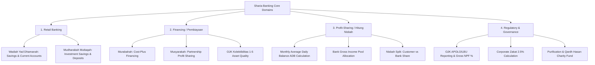

# 🕌 Sharia Banking Data Warehouse Simulation

A production-grade **Data Warehouse & Data Lineage Simulation** modeling the **Indonesian Sharia Banking Domain** (Perbankan Syariah Indonesia).

Built with **dbt-duckdb** following the Medallion Architecture (Raw Seeds -> Staging -> Intermediate -> Marts) and dynamically orchestrated using **Astronomer Cosmos** in **Apache Airflow**.

---

## 📌 Business Domain Overview & Sharia Principles

Sharia banking operates under Islamic Jurisprudence (*Fiqh Muamalat*) where interest (*Riba*) is strictly prohibited, replaced by profit-and-loss sharing (*Nisbah*), cost-plus profit margin (*Murabahah*), and joint venture partnerships (*Musyarakah*).

This data warehouse models 4 core Sharia banking pillars:



---

## 🧮 Financial Formulas & Sharia Mathematical Logic

### 1. Mudharabah Profit-Sharing (Perhitungan Nisbah & Bagi Hasil)
In Mudharabah accounts, bank acts as manager (*Mudharib*) and customer as capital provider (*Shahibul Maal*).

- **Monthly Average Daily Balance (Saldo Rata-Rata Harian / ADB)**:
  \[
  \text{ADB}_{\text{account}} = \frac{1}{N} \sum_{t=1}^{N} \text{Saldo Harian}_t
  \]
  *(where \(N\) is total days in the month)*

- **Account Share of Gross Income Pool (Hak Gross Pool)**:
  \[
  \text{Gross Income Share} = \text{Total Income Pool} \times \left( \frac{\text{ADB}_{\text{account}}}{\sum \text{ADB}_{\text{all\_mudharabah\_accounts}}} \right)
  \]

- **Customer Profit Payout (Bagi Hasil Nasabah)**:
  \[
  \text{Payout}_{\text{Customer}} = \text{Gross Income Share} \times \left( \frac{\text{Nisbah}_{\text{Customer}}\%}{100} \right)
  \]

- **Bank Retained Share (Hak Retensi Bank)**:
  \[
  \text{Retained}_{\text{Bank}} = \text{Gross Income Share} \times \left( \frac{\text{Nisbah}_{\text{Bank}}\%}{100} \right)
  \]

---

### 2. OJK Asset Quality & Gross NPF % (Non-Performing Financing)
Otoritas Jasa Keuangan (OJK) regulates asset quality into 5 classification categories (*Kolektibilitas*):
- **Kolek 1 (Lancar)**: Performing on time.
- **Kolek 2 (Dalam Perhatian Khusus / DPK)**: Overdue 1-90 days.
- **Kolek 3 (Kurang Lancar)**: Overdue 91-120 days. *(NPF)*
- **Kolek 4 (Diragukan)**: Overdue 121-180 days. *(NPF)*
- **Kolek 5 (Macet)**: Overdue >180 days. *(NPF)*

- **Gross NPF Ratio Formula**:
  \[
  \text{Gross NPF \%} = \frac{\sum \text{Outstanding Principal for Kolek (3 + 4 + 5)}}{\sum \text{Total Outstanding Principal}} \times 100\%
  \]

---

### 3. Zakat & Sharia Purification Fund (Dana Kebajikan / Qardh Hasan)
- **Corporate Zakat**:
  \[
  \text{Zakat Payable} = \text{Total Retained Net Bank Sharia Earnings} \times 2.5\%
  \]
- **Purification (Penyucian Harta)**: Late payment penalty fees (*Ta'zir*) and non-halal income (e.g. legacy conventional interest) cannot be recognized as bank profit and must be transferred to the **Qardh Hasan Charity Fund**.

---

## 🏗️ Data Warehouse Model Inventory

The dbt project `sharia_dw` is structured into 4 distinct layers:

### 1. Seeds Layer (`seeds/`)
| Seed Name | Description | Key Attributes |
| :--- | :--- | :--- |
| `raw_customers` | Customer Master | NIK, Full Name, Branch Code, City, Segment |
| `raw_accounts` | Deposit Accounts | Account Number, Akad Type (`WADIAH` / `MUDHARABAH`), Nisbah % |
| `raw_financing_contracts` | Financing Loan Book | Contract ID, Akad (`MURABAHAH` / `MUSYARAKAH`), Principal, OJK Kolektibilitas |
| `raw_daily_transactions` | Transaction Ledger | Transaction Date, DB/CR Flag, Amount, Channel |
| `raw_bank_income_pool` | Monthly Revenue Pool | Gross Amount, Income Source (Murabahah, Musyarakah, Sukuk) |
| `raw_purification_fund` | Purification Records | Ta'zir Penalty, Non-Halal Interest Amount |

---

### 2. Staging Layer (`models/staging/` - `tag:staging`)
- `stg_customers`: Cleaned customer demographics with Sharia compliance flags.
- `stg_accounts`: Standardized deposit accounts & calculated Nisbah Bank %.
- `stg_financing_contracts`: Standardized financing contracts with OJK Kolektibilitas labels & NPF flags.
- `stg_daily_transactions`: Transaction ledger with signed net amounts (`CR` positive, `DB` negative).
- `stg_bank_income_pool`: Bank monthly gross revenue streams.
- `stg_purification_fund`: Non-halal revenue and penalty records.

---

### 3. Intermediate Layer (`models/intermediate/`)
- `int_daily_account_balances`: Window function calculating daily ending balance per account across the month.
- `int_mudharabah_average_balances`: Computes monthly Average Daily Balance (ADB) for Mudharabah accounts.
- `int_financing_performance`: Merges contract details with customer branch demographics & NPF flags.
- `int_nisbah_profit_distribution`: Performs the complete Mudharabah profit-sharing allocation.

---

### 4. Marts Layer (`models/marts/`)
- **Retail Mart (`tag:marts_retail`)**:
  - `dim_customers`: Customer dimension.
  - `dim_accounts`: Account dimension.
  - `fct_daily_transactions`: Daily transaction fact table.
  - `fct_account_balances`: Daily account balance history.
- **Financing Mart (`tag:marts_financing`)**:
  - `dim_financing_contracts`: Financing contract dimension.
  - `fct_financing_portfolio`: Financing portfolio summary fact table.
- **Nisbah Mart (`tag:marts_nisbah`)**:
  - `fct_monthly_nisbah_payout`: Fact table recording profit payouts per Mudharabah account.
  - `rpt_mudharabah_yield_summary`: Executive summary report of Mudharabah yield % by branch.
- **Regulatory Mart (`tag:marts_reg`)**:
  - `rpt_ojk_apolo_lbu_summary`: OJK regulatory report with NPF % compliance alerts.
  - `rpt_zakat_purification_qardh`: Sharia governance report for Corporate Zakat & Qardh Hasan fund.

---

## ⚡ Astronomer Cosmos Airflow DAG Pipeline

File: `dags/sharia_banking_cosmos_dag.py`

Organizes dbt execution using `DbtTaskGroup` tagged by model domain:

```python
with DAG(dag_id="sharia_banking_dw_pipeline", schedule="@monthly", start_date=datetime(2026, 1, 1), ...):
    staging_group = DbtTaskGroup(group_id="staging_layer", render_config=RenderConfig(select=["tag:staging"]))
    retail_group = DbtTaskGroup(group_id="retail_marts", render_config=RenderConfig(select=["tag:marts_retail"]))
    financing_group = DbtTaskGroup(group_id="financing_marts", render_config=RenderConfig(select=["tag:marts_financing"]))
    nisbah_group = DbtTaskGroup(group_id="nisbah_profit_sharing_marts", render_config=RenderConfig(select=["tag:marts_nisbah"]))
    regulatory_group = DbtTaskGroup(group_id="regulatory_governance_marts", render_config=RenderConfig(select=["tag:marts_reg"]))

    # Execution Graph
    start_pipeline >> staging_group
    staging_group >> retail_group & financing_group
    retail_group & financing_group >> nisbah_group
    nisbah_group >> regulatory_group >> end_pipeline
```

---

## 🛠️ Operations & Execution Guide

### 1. Run End-to-End Simulation Script
```bash
uv run python sharia_banking_dw/scripts/run_sharia_dw.py
```

### 2. Launch Local Airflow Web UI
```bash
cd /home/al/Projects/sandbox-hub/analysis/dbt-bq
export AIRFLOW_HOME=$(pwd)/sharia_banking_dw
export AIRFLOW__CORE__DAGS_FOLDER=$(pwd)/sharia_banking_dw/dags

uv run airflow standalone
```
- Web UI: **`http://localhost:8080`**
- Credentials: Username `admin` | Password `admin`

### 3. Run dbt CLI Commands Manually
```bash
cd sharia_banking_dw/dbt_project
uv run dbt seed --profiles-dir .
uv run dbt run --profiles-dir .
uv run dbt test --profiles-dir .
```
