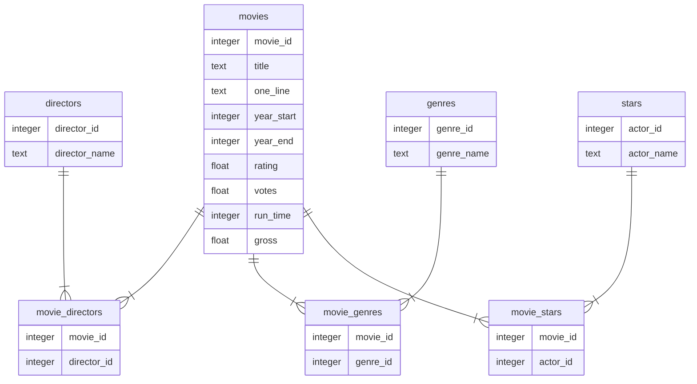

# CAD-IT - Data Engineer

This document outlines the solution for the CAD-IT IoT Centre Code Test for Data Engineers.

1. Create a data model (conceptual data model is mandatory, logical, and physical data model  is a plus). 


From the data, we can see that the conceptual model is simple. Movies have multiple directors, stars, and genres. So, I directly created an ERD. Here's the ERD.




2. Create a database based on the data model that has been created (No. 1) (using Oracle, SQL  Server, PostgreSQL, or another database) 

I use PostgreSQL and Python for processing the data. You can start PostgreSQL by checking the file `docker-compose.yaml` and running `docker compose up -d`.

You can check `sql/ddl.sql` for the DDL.

3. Create an ETL script to import the movies.csv dataset into the created database (No. 2) (using python, Java, JS, SQL, or SSIS) 

The data is still not normalized. I think it's uncommon to normalize data from a denormalized form, but let me see if we can normalize it.

The script to clean the data and normalize it is provided in the `main.py`.

I am using pandas for processing data. Actually, we don't need to specify data types or create a DDL first. We can directly utilize pandas `to_sql`. It might be different if the data is big; it could become slower. Since it's not really big, we can use pandas for faster development.
  
4. Create a query to display (Using Stored Procedure or View is a plus) 

```sql
-- View for a: Number of unique film titles
CREATE VIEW unique_film_titles AS
SELECT COUNT(DISTINCT title) AS num_unique_titles
FROM public.movies;

-- View for b: Film Title, Year of Release, and Rating of the film starring Lena Headey Sort By Year of Release.
CREATE VIEW lena_headey_films AS
SELECT title, year_start, rating 
FROM movies m 
LEFT JOIN movie_stars ms ON m.movie_id = ms.movie_id 
JOIN stars s ON ms.actor_id = s.actor_id 
WHERE s.actor_name = 'Lena Headey' 
ORDER BY year_start;

-- View for c: The name of the director and total gross of the films that have been directed.
CREATE VIEW director_gross AS
SELECT director_name, SUM(gross) AS total_gross
FROM directors d 
JOIN movie_directors md ON d.director_id = md.director_id 
JOIN movies m ON md.movie_id = m.movie_id
GROUP BY 1
ORDER BY total_gross DESC NULLS LAST;

-- View for d: Film Title, Year of Release, and Rating of 5 films that have comedy genre with the largest gross.
CREATE VIEW top_comedy_films AS
SELECT title, year_start, rating, gross
FROM genres g 
JOIN movie_genres mg ON g.genre_id = mg.genre_id 
JOIN movies m ON mg.movie_id = m.movie_id 
WHERE g.genre_name = 'Comedy'
ORDER BY gross DESC NULLS LAST
LIMIT 5;

-- View for e: Film Title, Year of Release and Rating of the film directed by Martin Scorsese and starring Robert De Niro.
CREATE VIEW scorsese_deniro_films AS
SELECT title, year_start, rating
FROM directors d 
JOIN movie_directors md ON d.director_id = md.director_id 
JOIN movies m ON md.movie_id = m.movie_id
JOIN movie_stars ms ON m.movie_id = ms.movie_id 
JOIN stars s ON ms.actor_id = s.actor_id
WHERE director_name = 'Martin Scorsese' AND actor_name = 'Robert De Niro';
```


[[Data Engineering]]